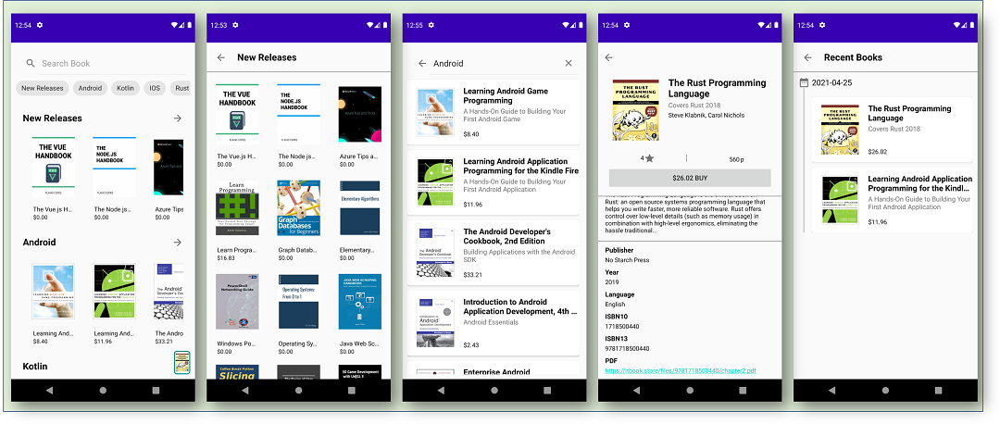

MyLibrary
=========

MyLibrary is a sample app with the modern android development tools.

Tech Stack
----------

* [Kotlin][0] + [Coroutine][1] + [Flow][2]
* [Android Architecture Components][10]
    * [Lifecycle][11]
    * [ViewModel][12]
    * [View Binding][13] & [Data Binding][14]
    * [Room][15]
    * [Paging3][16]
* [Material Components][20]
* [Hilt][30]
* [Retrofit][40] + [GSON][41]
* [Glide][50]
* [Firebase Crashlytics][60]
* [Gradle Kotlin DSL][70]

[0]: https://kotlinlang.org/docs/home.html
[1]: https://kotlinlang.org/docs/reference/coroutines-overview.html
[2]: https://kotlinlang.org/docs/flow.html#flows
[10]: https://developer.android.com/topic/libraries/architecture
[11]: https://developer.android.com/jetpack/androidx/releases/lifecycle
[12]: https://developer.android.com/topic/libraries/architecture/viewmodel
[13]: https://developer.android.com/topic/libraries/view-binding
[14]: https://developer.android.com/topic/libraries/data-binding
[15]: https://developer.android.com/training/data-storage/room
[16]: https://developer.android.com/topic/libraries/architecture/paging/v3-overview
[20]: https://github.com/material-components/material-components-android
[30]: https://dagger.dev/hilt/
[40]: https://square.github.io/retrofit/
[41]: https://github.com/google/gson
[50]: https://github.com/bumptech/glide
[60]: https://firebase.google.com/docs/crashlytics/get-started?platform=android 
[70]: https://docs.gradle.org/current/userguide/kotlin_dsl.html

Architecture
------------

Based on MVVM architecture and repository pattern.

License
-------

    Copyright 2021 Lee Woochan <dncks1525@gmail.com>
    
    Licensed under the Apache License, Version 2.0 (the "License");
    you may not use this file except in compliance with the License.
    You may obtain a copy of the License at
    
       http://www.apache.org/licenses/LICENSE-2.0
    
    Unless required by applicable law or agreed to in writing, software
    distributed under the License is distributed on an "AS IS" BASIS,
    WITHOUT WARRANTIES OR CONDITIONS OF ANY KIND, either express or implied.
    See the License for the specific language governing permissions and
    limitations under the License.